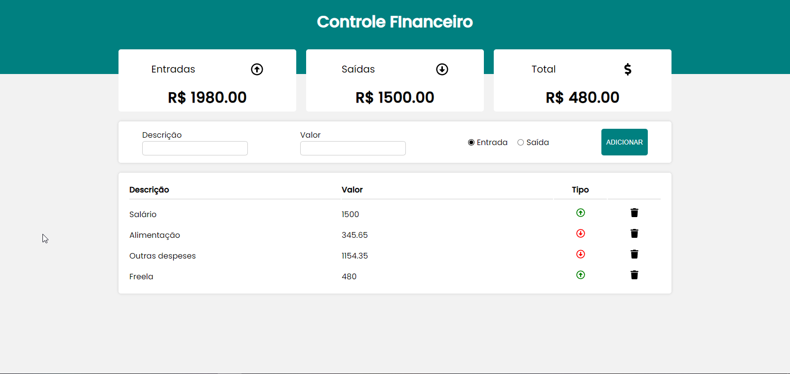

<h1 align="center"> Gerador de senha </h1>

  <a href="#-tecnologias">Tecnologias</a>&nbsp;&nbsp;&nbsp;|&nbsp;&nbsp;&nbsp;
  <a href="#-projeto">Projeto</a>&nbsp;&nbsp;&nbsp;|&nbsp;&nbsp;&nbsp;

 
 

  

## 🚀 Tecnologias

Esse projeto foi desenvolvido com as seguintes tecnologias:

- JavaScript
- localStorage
- React
- Git e Github
- Local Storage

## 💻 Projeto

O controlador de finanças é um projeto que tem a finalidade de controlar e armazenar dados no banco do navegador para o usuário. Ele permite adicionar e remover qualquer produto de acordo com as necessidades.
